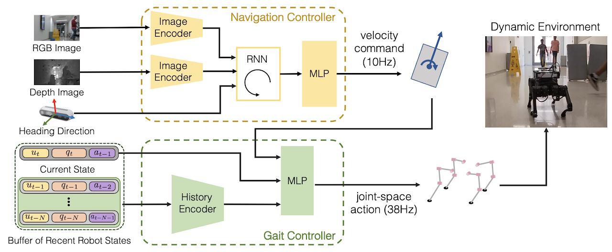

# Implementation Details

The navigation controller predicts the target velocity commands at 10Hz. The low-level gait controller takes the buffer of recent velocity commands, robot states and previous joint-space actions as input and produces joint-space action commands at 38Hz to actuate the robot. 

## Navigation Controller 
The navigation policy uses a ResNet18-backbone network [[1]](#1) as the image encoder. The encoded image features are flattened and concatenated with the 1D heading direction value. The concatenated vector is passed through a two-layer multi-layer perceptron (MLP) with 1024 hidden units in each layer. The input RGB-D images have a size of $212\times 120$. For imitation learning, we develop our behavioral cloning implementations with the robomimic framework [[2]](#2). For the recurrent neural networks, we use LSTM [[3]](#3) of two layers with 400 hidden units for each layer. The GMM policy output has 5 modes.

## Gait Controller
Each tuple in the buffer $&#8492;\_t$ is a 48D vector, containing $u_i\in&#8477;^2$, $q_i\in&#8477;^{34}$, and $a_{i-1}\in&#8477;^{12}$. $u_i$ consists of the forward linear velocity and angular velocity. $q_i$ consists of joint positions and velocities of each leg (24D), binary foot contact states for each foot (4D), the IMU measurement of the robot's body orientation (3D), and the angular velocities (3D). $a_{i-1}$ is a 12D joint-space command of the previous time step.  We choose $T=11$ for the size of the history buffer. 
We use 1D temporal convolution to transform the input $T+1$ tuples $&#8492;\_t$ into a 32D vector. Specifically, the 48D tuple of each time step is first encoded by a linear layer, followed by 3 layers of temporal convolution. The feature from temporal convolution is flattened and projected by another linear layer into the 32D vector.
We concatenate the 48D tuple of the most recent state $(u_t,q_t,a_{t-1})$ and the encoded 32D vector of history states. This concatenated feature is passed through a two-layer MLP of 256 hidden units to produce a Gaussian distribution of joint-space actions. The reward function for training $\pi_L$ consists of the terms for tracking commands, balancing the body, minimizing energy consumption, and regulating foot contacts, as below.

- Tracking commands:  $K(k_1 |{e_{\psi}|^2) e^{k_2 |\boldsymbol{e}_{xy}|}} $
- Balancing the body:  $K(k_3|\boldsymbol{e}_{xy}|^2)K (k_4 |\boldsymbol{\theta}|^2)$
- Minimizing energy consumption:  $K(k_3|\boldsymbol{e}_{xy}|^2) E$
- Regulating foot contacts: $k_5 \left(\max(n_1-3, 0) - n_2 \right)$

where $K(\cdot) := 1- \tanh (\cdot)$ and $k_1, ... k_5$ are given as positive weight coefficients. $E$ is the energy consumption, $\boldsymbol{\theta}$ is the vector of roll and pitch,  $\boldsymbol{e}\_{xy}$ is the linear velocity errors in the x and y axes, and ${e}_{\psi}$ is the yaw rate error. $n_1$ , $n_2$ are number of foot contacts, and non-foot contacts.
The terms of tracking commands and balancing the body are designed to improve the stability of tracking commands, and the other two terms improve the gait patterns. 64 actors of distributed PPO are used for training.

## References
<a id="1">[1]</a> K. He, X. Zhang, S. Ren, and J. Sun. Deep residual learning for image recognition. In Proceedings of the IEEE conference on computer vision and pattern recognition, 2016.

<a id="1">[2]</a> A. Mandlekar, D. Xu, J. Wong, S. Nasiriany, C. Wang, R. Kulkarni, L. Fei-Fei, S. Savarese, Y. Zhu, and R. Martı́n-Martı́n. What matters in learning from offline human demonstrations for
robot manipulation. Conference on Robot Learning, 2021.

<a id="1">[3]</a> S. Hochreiter and J. Schmidhuber. Long short-term memory. Neural computation, 9(8), 1997.
